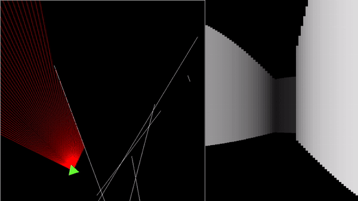

# 2D Raycaster 

A basic *raycaster* using SFML



### Installing 

You need to install SFML

```sudo apt-get install libsfml-dev```

If you already installed it but you didn't use the standard package manager, you will have to modify the Makefile and recompile it after specifying you path to SFML.

You'll also need to install the Eigen library.

```sudo apt-get install libeigen3-dev```

### Running 

You only have to use the Makefile.

```make```

This will compile and run the program.
